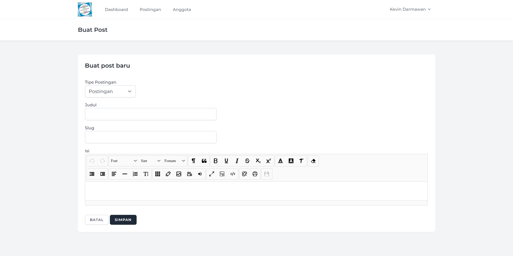
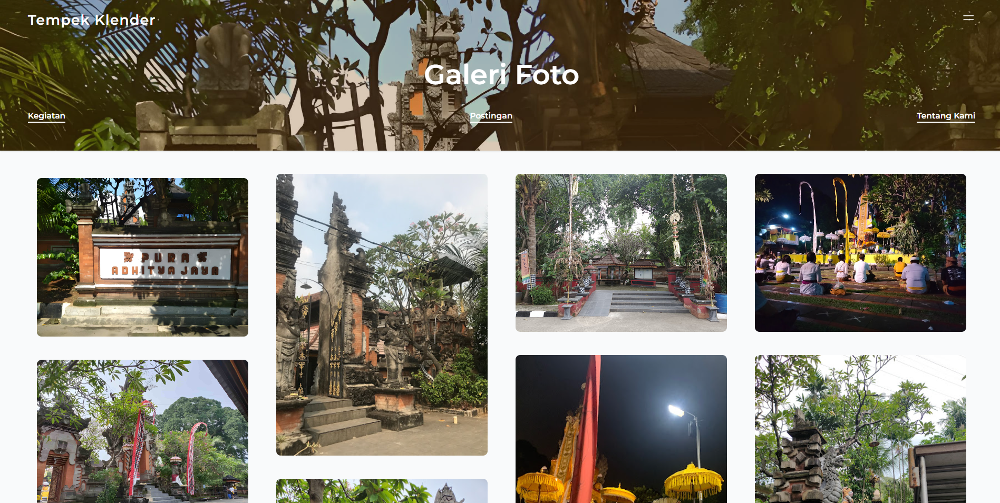

# Web Portal Tempek Klender

## Overview
Web Portal Tempek Klender is a dynamic and interactive web platform designed for the Tempek Klender organization. This portal serves as a centralized hub for members to stay informed about upcoming events, view posts, manage organizational roles, and engage with various features that promote community involvement and efficient management.

## Key Features

1. **Homepage**
     
   - A welcoming and intuitive landing page showcasing the latest posts, upcoming events, and announcements.

3. **Create Post**

   - A user-friendly interface allowing authorized members to create and share new posts, complete with text, images, and multimedia content.

4. **Dashboard**

   - A comprehensive dashboard offering an overview of the organization's activities, including recent posts, member statistics, and event highlights.

5. **Dashboard - Posts Management**

   - An administrative view where authorized users can manage all posts, including editing, deleting, and updating content.

6. **Dashboard - Members Management**

   - A dedicated section for managing member information, viewing member profiles, and updating member roles and permissions.

7. **Edit Member**
 
   - A detailed form for editing member profiles, including contact information, roles, and membership status.

8. **Edit Post**
 
   - A streamlined interface for editing existing posts, allowing for quick updates and modifications to keep content relevant and accurate.

9. **Gallery**

   - A visual gallery displaying images from past events, gatherings, and other organizational activities, fostering a sense of community and shared memories.

10. **Member Profile Photo History**

   - A feature that maintains a history of profile photos for each member, providing a visual timeline of their engagement with the organization.

11. **Permission Manager**

    - A powerful tool for managing user permissions, ensuring that members have appropriate access to various features and administrative functions.

12. **Roles Manager**
 
    - An interface for defining and managing roles within the organization, allowing for customized access levels and responsibilities.

13. **View Member**

    - A detailed member profile view, showcasing individual member information, role within the organization, and engagement history.

## Objectives
- **Community Engagement:** Enhance member participation and interaction through a centralized platform for information sharing and event announcements.
- **Efficient Management:** Streamline administrative tasks such as post management, member updates, and role assignments.
- **Transparency and Communication:** Foster a transparent communication channel within the organization, ensuring all members are well-informed and connected.

## Target Audience
- **Organization Members:** Active members looking to stay updated on organizational activities, view posts, and participate in events.
- **Administrators:** Individuals responsible for managing content, member information, and overall platform maintenance.
- **New Members:** Prospective members interested in learning more about Tempek Klender and its community.

By leveraging these features, Web Portal Tempek Klender aims to build a more engaged, informed, and efficiently managed community, ensuring a cohesive and collaborative organizational environment.
